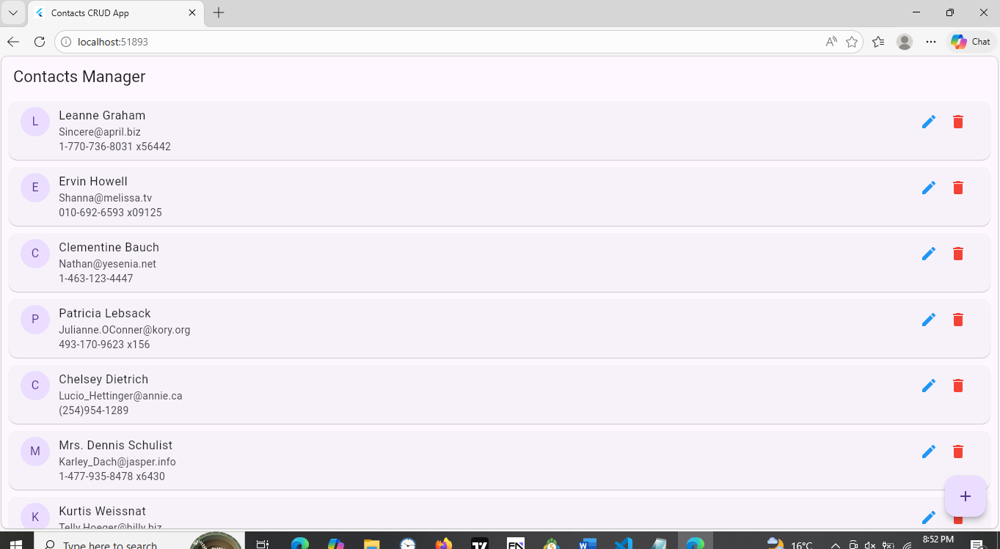
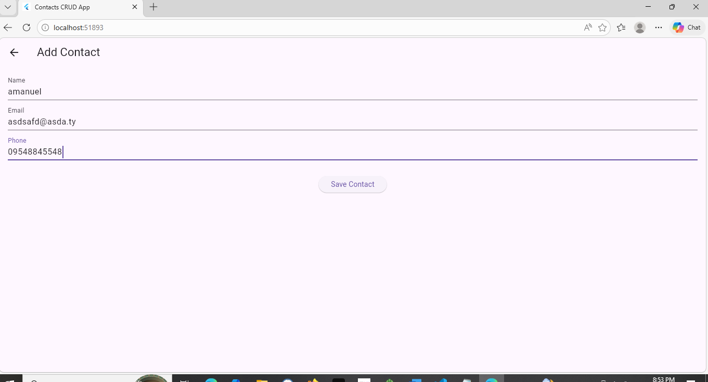
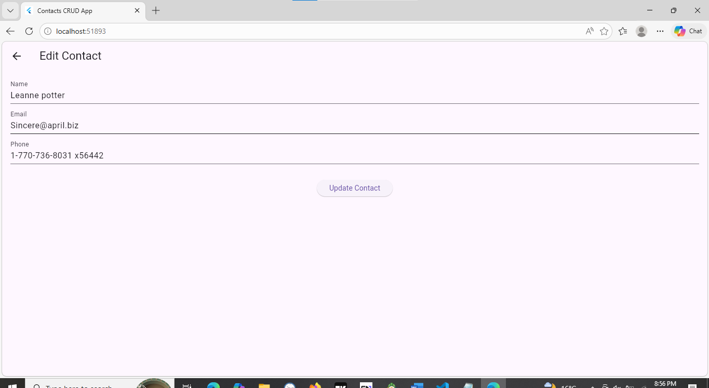
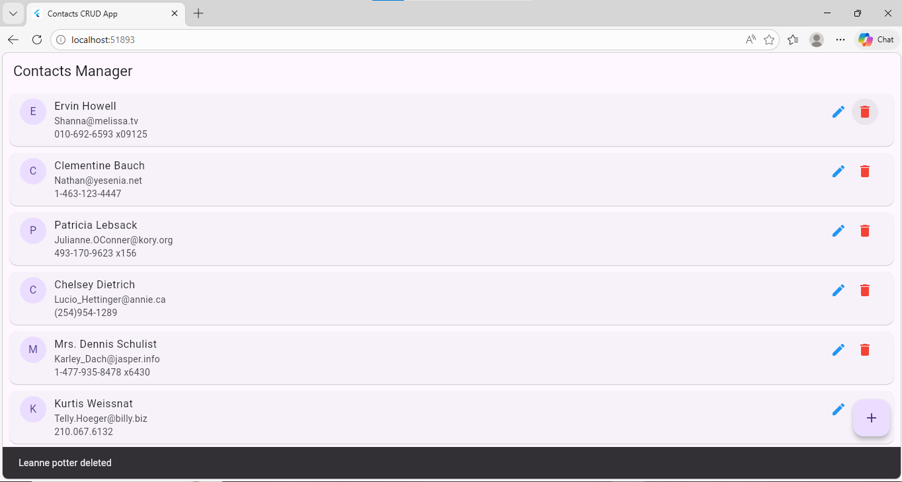

# Assignment 2: CRUD API consumption using http and state management using Provider

## Student information
* **Name:** Amanuel Solomon
* **ID:** UGR/0540/16
* **Section:** 2

------

## Running App screenShots

